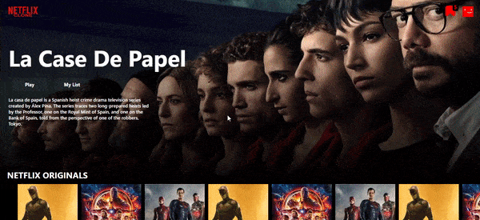
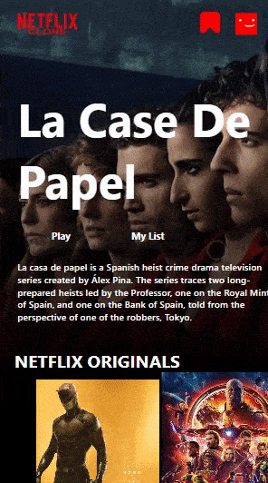

<h1 align="center">NetflixClone</h1>

<p align="center"> Netflix Clone with Template and Marvel API </p>
<h3 align="center"><a href="https://nfclone.vercel.app/#/"> Click me </a> for live demo.</h3>

###  **Web**
<p align="center"></a> </p>

###  **Mobile**
<p align="center"></a> </p>

<div align="center">
<a href="https://vuejs.org/" target="_blank" rel="noreferrer">  </a> 
<a href="https://vitejs.dev" target="_blank" rel="noreferrer">  </a> 
 <a href="https://tailwindcss.com/" target="_blank" rel="noreferrer">  
 </a>  
<a href="https://developer.mozilla.org/en-US/docs/Web/JavaScript" target="_blank" rel="noreferrer">  </a> 
<a href="https://vercel.com" target="_blank" rel="noreferrer">  </a> 

</div>


### 📔 **About**
Netflix Clone, the first page is a template, the second page is filled with MarvelComicsAPI.


### 📜 **Features**
- Interface Language is English
- Responsive
- 2 Page
- First Page is Template ( Top-left Netflixclone icon )
- Second Page with Marvel Comics API ( Top-right PP icon )
- Favorite counter
- Detailed review ( Second Page)
- Add favorite
<!-- ### 💻 **Usage** -->


<!-- - [Vue](https://vuejs.org/) -->


### #️⃣ **Commands for Local Machine**

_Run on Local Machine_

```sh
git clone https://github.com/boranbatuhan/netflixclone.git  // Clone the repository.
cd netflixclone                                             // Change directory.
npm install                                                 // Install dependencies.
npm run dev                                                 // Run development mode.
npm run build                                               // Build the project.
```